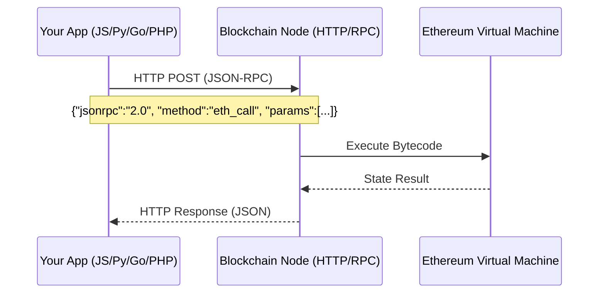
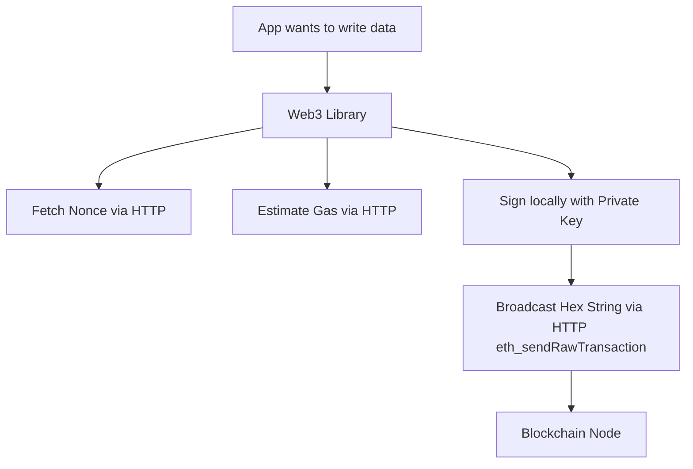

# Multi-Language Blockchain Integration Architecture

Welcome to the ultimate guide and boilerplate for connecting **any** application to an EVM-compatible blockchain. 

This repository contains concrete implementations for **JavaScript (React)**, **Python (FastAPI)**, **Go (Geth)**, and **PHP**. However, the primary goal of this repository is to teach the **underlying architecture**. Once you understand the concepts below, you won't be reliant on specific tutorials; you will understand exactly how to integrate a blockchain with *any* platform, language, or framework.

---

## 🏛️ The Universal Architecture (High-Level)

The biggest misconception in Web3 development is that you need "special" blockchain technology to talk to a smart contract. **You do not.**

A blockchain node (whether it's running locally on your laptop, or hosted by Alchemy/Infura) is fundamentally just an **HTTP and WebSocket server**. It adheres strictly to a standard protocol called **JSON-RPC**.

Any programming language capable of sending a JSON payload via an HTTP `POST` request can interact with the blockchain.

---

## 🔤 The Translation Layer: What is an ABI?

When you write a Smart Contract in Solidity, it is compiled down into unreadable hexadecimal bytecode that only the Ethereum Virtual Machine (EVM) understands. 

To bridge the gap between your human-readable programming language and the EVM, the compiler generates an **Application Binary Interface (ABI)**. 

The ABI is simply a JSON file that acts as a dictionary. It tells your application: *"If you want to call the `greet()` function, you must send the hex signature `0xcfae3217` to the node."*

### Dynamic vs. Static Loading
Different languages handle the ABI differently, which you will see in our examples:
*   **Dynamic Languages (JavaScript, Python, PHP):** You simply load the raw `Greeter.json` file at runtime. The Web3 library parses it on the fly.
*   **Static Languages (Go, Rust):** You use a code-generator tool (like `abigen` in Go) to compile the ABI into native, strongly-typed source code *before* you run the app.

---

## 📖 Reading vs. ✍️ Writing State

Understanding the massive architectural difference between reading data and writing data is critical.

### 1. Reading (`eth_call`)
Reading data from a blockchain is **free**, **instantaneous**, and **local**. 
When your app requests data, the node simply looks up the current state in its local database and returns it. You do not need a private key, and no miners are involved.

### 2. Writing (`eth_sendRawTransaction`)
Writing data (changing state) requires global consensus.
1. Your app must **sign** the transaction offline using a Private Key.
2. The transaction is broadcasted to the network.
3. You must **wait** for a miner/validator to include it in a block.
4. It costs money (Gas).

---

## 🔐 The Cryptography Hurdle

If interacting with the blockchain is just sending HTTP requests, *why do we need libraries like `ethers.js`, `web3.py`, or `web3.php`?*

Because of **Writing**.

While any language can send an HTTP request to read data trivially, constructing a valid Ethereum transaction requires calculating Nonces, estimating Gas, and mathematically signing the payload using the `SECP256k1` elliptic curve algorithm. 

**Web3 libraries are simply HTTP clients with heavy cryptographic math engines attached to them.** They abstract the painful cryptography so you can just call `contract.setGreeting("Hello")`.

---

## 📁 Repository Implementations

This monorepo provides production-ready implementations of the concepts above.

### 1. The Smart Contract (`/contracts`)
A Hardhat environment containing `Greeter.sol`. This is the single source of truth.
*   **Run Node:** `cd contracts && pnpm run node`
*   **Deploy:** `cd contracts && pnpm run deploy:local`

### 2. JavaScript / TypeScript Frontend (`/frontend`)
A **Next.js** application demonstrating direct client-to-blockchain integration using modern React hooks (`wagmi` & `viem`).
*   **Run:** `cd frontend && pnpm run dev`

### 3. Python Backend (`/python-client`)
A production-grade **FastAPI** backend that acts as an intermediary. It securely signs transactions server-side, completely hiding the blockchain from the end-user.
*   **Run:** `cd python-client && uvicorn src.main:app --reload` (See python-client/pyproject.toml for venv setup).

### 4. Go Client (`/go-client`)
A high-performance **Golang** client demonstrating statically-typed `abigen` bindings using the official `go-ethereum` library.
*   **Run:** `cd go-client && go run main.go`

### 5. PHP Client (`/php-client`)
A modern **PHP CLI** demonstration wrapping callback-heavy HTTP logic into a clean, object-oriented service using Composer standards.
*   **Run:** `cd php-client && php index.php`
